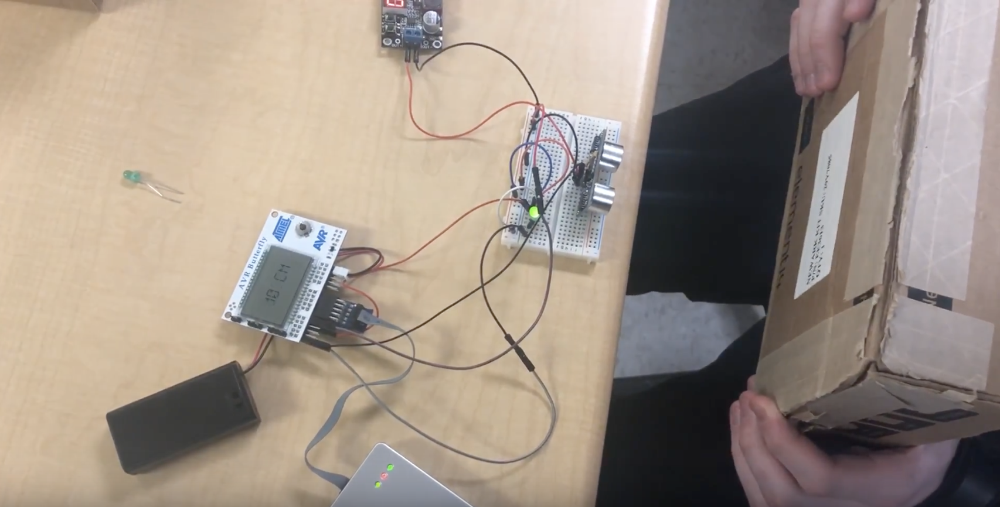

# Final Project: System Integration
## Overview
In this project, we combined many sensors, input sources and outputs to create a fully integrated system.

Concepts such as sensor I/O, Analog to Digital Converters, distance sensors, servos, interrupts, timers and debouncing were used in this project.

## Components
This project was built upon the [AVR Butterfly Board](http://www.microchip.com/webdoc/avrbutterfly/avrbutterfly.wb_AVRBFLY_Introduction.Introduction.html).

The external sensor used in this project was the ubiquitous [PING))) Sensor](https://www.parallax.com/sites/default/files/downloads/28015-PING-Sensor-Product-Guide-v2.0.pdf), which required both timed inputs and outputs. The Butterfly's built in ADC was also used to measure the position of a potentiometer.

The three outputs used in this assignment were a [continuous servo](https://www.digikey.com/product-detail/en/parallax-inc/900-00005/900-00005-ND/361277?WT.srch=1&gclid=Cj0KCQiAzMDTBRDDARIsABX4AWxfzv4RGQTkLXnrCBPfGEzZSSpATafj2P5Nz8xWd49nlzjZmxgBqHoaAqd7EALw_wcB), an LED, and the Butterfly's built in LCD.

## Features
The features of this project are as follows:
* At all times, displays distance detected by PING))) Sensor in inches on LCD
* Test the voltage from the ADC
  * If it is between 0-1 volts (about 0-33%)
    * If distance is more 30 inches from sensor
      * turn servo in clockwise direction via PWM
      * turn LED off
    * If distance is between 10 and 30 inches
      * turn servo off
      * blink LED at rate determined by distance
    * If distance is less than 10 inches
      * turn servo in counter-clockwise direction
      * turn LED on (solid)
  * If it is between 1-2 volts (about 34%-66%)
    * Turn servo off
    * Blink LED at 2 second rate
  * If it is between 2-3 volts (about 67%-100%)
    * Turn servo off
    * Blink LED at 5 second rate
    
## Code
All of the code for this project is detailed with comments in `main.c`.

Much of the code relies on preliminary calculations detailed in the `#define`s toward the top.

The setup is undertaken at the top of the `main()` function, where most of the interrupts, timers and I/Os are defined.

The loop of `main()` handles the LCD display, the ADC readings, and the servo direction/LED rate control based on the ADC value and distance.

Timer0 is used as both a counter for the PING pulse return time (to calculate distance), as well as a timer to initiate another measurement. The `TIMER0_OVF` interrupt will occur when sufficient time after the PING return has passed, thus initiating another pulse through the convenience functions. The `PCINT1` interrupt also aids in listening for the start and stop of the pulse return, so that the time (and thus length) can be calculated.

Timer1 is used to blink the LED through the `TIMER1_COMPA` interrupt, and self-adjusts its compare value based on `led_rate` set in `main()`.

Timer2 is is used as a direct PWM control for the motor, and had to be used as opposed to other timers due to the specific pinout of the Butterfly. The other PWM I/O pins were being used by the joystick and/or PING))) sensor. Each time Timer2 overflows, the `TIMER2_OVF` interrupt is called, which resets the timer count to a value determined by `servo_pulse`. This allows a variable PWM pulse to be sent to the servo, thus changing its direction.

## Disclaimer
`LCD_Driver.c` and `LCD_Driver.h` were provided to me by my professor, Dr. Helferty.
