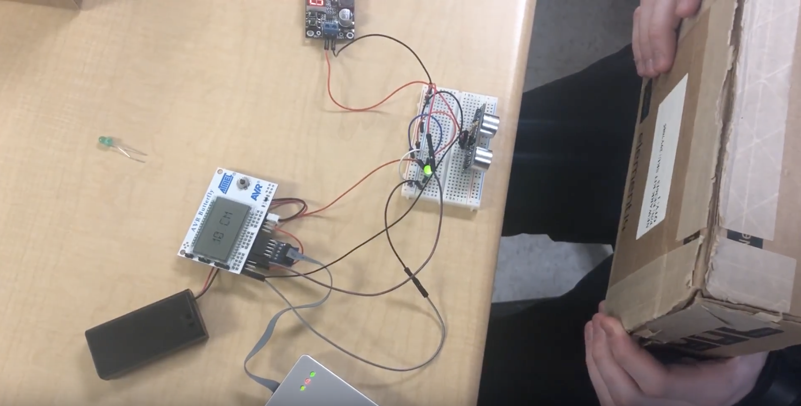

# MicroprocessorProjects
This project contains the AVR code developed for my Microprocessor Systems course at Temple University.

## Final Project: Tachometer
Our task for this project was to create a tachometer using a DC motor, a paper disk and an optointerrupter:

The task required exhaustive use of concepts such as Pulse Width Modultation, interrupts, timers and software debouncing. In addition, the use of a motor in the circuitry introduced a point of failure which was mitigated by separating the motor circuit and microcontroller using an optocoupler.

## Final Project: System Integration
In this project, we combined many sensors, input sources and outputs to create a fully integrated system.

Concepts such as sensor I/O, Analog to Digital Converters, distance sensors, servos, interrupts, timers and debouncing were used in this project.
